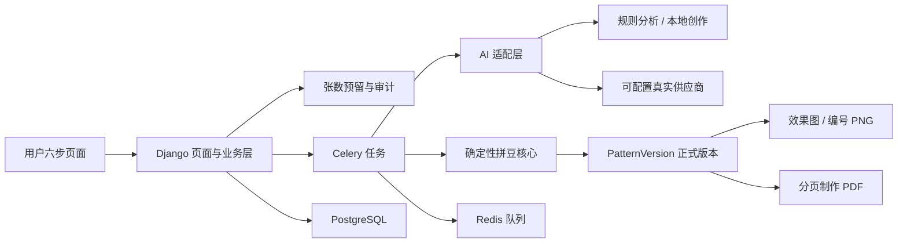

# 系统架构与关键决策

## 总览

前台只呈现上传、分析、设置、生成、预览、保存六个可理解阶段；后台执行格式校验、主体分析、路由选择、张数预留、图片处理、颜色量化、硬校验、视觉复查、结算和文件输出。

## 边界

| 模块 | 负责 | 不负责 |
|---|---|---|
| `services/image_processing` | 网格、色板、材料、PNG、硬校验 | 用户、数据库、模型调用 |
| `services/ai` | Prompt、结构化契约、供应商适配、规则降级 | 页面和张数结算 |
| `apps/creation` | 任务状态、分析/生成编排、配置快照 | 运营配置编辑 |
| `apps/memberships` | 会员权限、周期张数、预留/使用/释放 | 模型能力判断 |
| `apps/patterns` | 作品、不可变版本、导出关联 | 上传流程 |
| `apps/operations` | 可版本化后台配置和审计 | 运行中任务改写 |

## 一致性与失败语义

1. 正式网格同时驱动网页预览、PNG、PDF 和材料清单。
2. 生成前预留 1 张；成功才转为使用；取消或最终失败释放。
3. 相同任务的预留、使用和释放均有幂等键。
4. 基础生成可规则降级；高级内容创作不可在真实模型失败后用 mock 冒充。
5. 内容型修改创建父版本关系；参数型修改复用底图且不使用新张数。
6. 会员、模型和质量配置在任务创建时快照，保证排队期间后台变更不会改变语义。

## 学习复盘

项目先实现无 AI 的确定性图纸核心，再加入数据模型、闭环、队列、AI、高级创作和导出。这个顺序把“模型看起来不错”和“图纸真的可制作”分开验证，也让每个阶段都有可运行测试，而不是到最后才发现材料数量或结算不一致。
